# Debugging with Thonny

## Programming mistakes

Everyone makes mistakes—even seasoned professional developers!

Python is pretty good at catching mistakes like syntax errors and run-time errors, but there’s a third type of error that you may have already experienced. **Logic errors** occur when an otherwise valid program doesn’t do what was intended.

For example, type the code below and save it has `buggy_code.py`. 

``` python
def add_underscores(word):
    new_word = "_"
    for index in range(len(word)):
        new_word = word[index] + "_"
    return new_word

phrase = "hello"
print(add_underscores(phrase))
```

The output expected is `_h_e_l_l_o_`. Run it and you will see it actually outputs `o_`.

Logic errors cause unexpected behaviours called **bugs**. Removing bugs is called **debugging**, and a **debugger** is a tool that helps you hunt down bugs and understand why they’re happening. 

Knowing how to find and fix bugs in your code is a skill that you will use for your entire coding career!

## Using Thonny's Debugger

To debug `buggy_code.py` we need to understand the debugging tools we have at our disposal. Thonny has a debugger built-in, but before we explore it, we need to make sure you have the correct setup.

Open the *View* menu and ensure both *Stack* and *Variables* are ticked.


To enter into Thonny's Debugger click on the **Debug** button.


### Contolling the debugger

To see how the debugger works, let’s start by writing a simple program without any bugs. 

Type the following into Thonny and save it as `debug_a.py`:

``` python
names = ["michelle", "nicole", "simone", "emma"]

for name in names:
    name = name.capitalize()
    print(f"Hello {name} how are you this morning")
```

Now start Thonny's dubugger.

Your Thonny should now look like the image below:

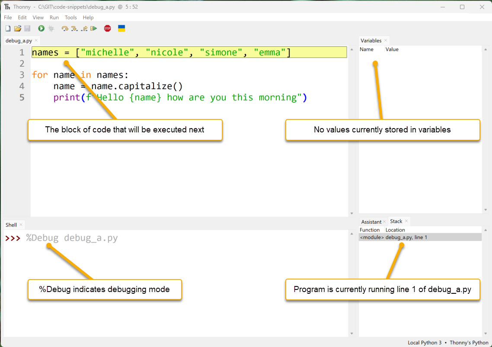

- **Code Panel:** The execution of code is paused and the next block of code to be executed is highlighted yellow
- **Variables Panel:** Nothing is displayed as no values have been assigned to any variables yet.
- **Shell Panel:** `%Debug` launches the program (`debug_a.py`) in debugging mode.
- **Stack Panel:** Shows the current function and module that is running.

Something else has happened, other debugging buttons are now available.


Lets see how they work.

#### Step into button

Click the **Step into** button. Thonny will now execute the previous highlighted code block. The new highlighted code indicated the next part of the code to be excuted. In this case it is the list `["michelle", "nicole", "simone", "emma"]`.


Clicking **Step into** again highlights the `"michelle"` showing that Python will now evaluated this item.

Continuing and the `"michelle"` turns into a blue `'michelle'` indicating that it is has been read byt he interpreter.

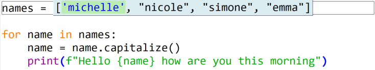

Four more **Step into** clicks (or pressing F7 on your keyboard), and all the strings have been read by the interpreter.

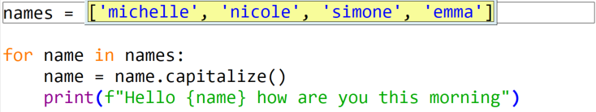

The next **Step into** shows that Python is now ready to write the list into the vairable `names`.


Our next **Step into** moves to the next block of code to be processed, and we can see in the **Variables panel** that `["michelle", "nicole", "simone", "emma"]` has been stored in `names`. 


Notice that more than one line is highlighted. Thonny is highlighting all the code that is part of the `for` loop. We'll now step through this.

**Step into** highlights `names` as the first element of the `for` statement that needs to be processed. 


A further **Step into** replaces `names` with the list that is stored in `names`.


Since this is a `for` loop, the next **Step into** takes the first element of the list (`'michelle'`) and prepares to store it in the variable `name`.

> Note: do not confuse `name` with `names`. They're very close, but Python is very precise.


Clicking **Step into** moves the highlight onto line 4, and the `name` variable is now also displayed in the **Variables panel**.


The next three **Step into** clicks highlights the `name.capitalize()` , then `name` and finally replaces `name` with `'michelle'`

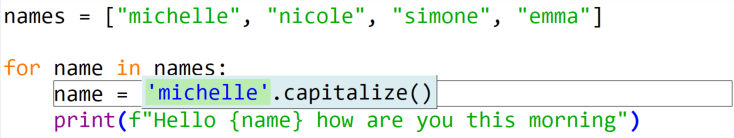

The next three **Step into** clicks then apply the `capitalize()` method to `'michelle'` changing it to `'Michelle'` and then overwrites the value in `name` with `'Michelle'`. Line 4 is now complete, so line 5 is now highlighted.


The next five **Step into** clicks show how an f-string is processed and then printed to the terminal. It also show that a call to the `print()` function returns a `None` value.

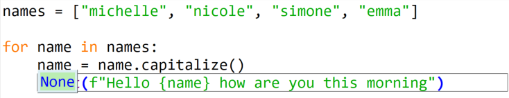

Click **Step into** one more time and you return to line 3 and the `for` statement, with the next element from the `names` list (`'nicole'`) ready to be written to the `name` variable.


Click **Step into** one more time, and then we'll use this next iteration of the `for` loop to look at how **Step over** works.

#### Step over button
The **Step over** function will process all the highlighted code without going into the detailed steps. In the situation below **Step over** will take the value stored in `name` (`'nicole'`), capitalize it to `'Nicole'` and then write it back to `name`. 


Click the **Step over** button and you will see the results below. Notice the value stored in `name`.


Click **Step over** again and line 5 is executed and the highlight returns to the line 3 `for` statement.

We use **Step over** when we know that the highlighted code doesn't contain the bug we are looking for, so we want to simply execute it and move onto the next block of code.

Click **Step over** and then **Step into** to move your code to the position below, so we can now look out **Step out**.


#### Step out button

The **Step out** is used to complete the remainder of the block of code currently being processed. Look back at the last example, and notice the grey box around line 4? This box indicates that we have stepped into line 4 and are processing it. Click **Step out** and Thonny will move back up a level to highlight all of line 4.

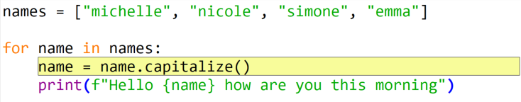

Click **Step out** again will move back up to outside the `for` loop and, therefore, finish the program.

#### Resume button and breakpoints

The last button we need to look at is the **Resume** button. This work in conjunction with **breakpoints**. Basically the **Resume** button will execute the code until it finds a **breakpoint**. To add a **breakpoint** to your code click on the line number that you wish to pause the program on.

Let's try it out. Click on the line number 4. A red dot should appear between the number and the code panel (as below):


Now click **Debug**. Notice that the program runs and then pauses at **breakpoint** where you can the values of all the variables at that point.

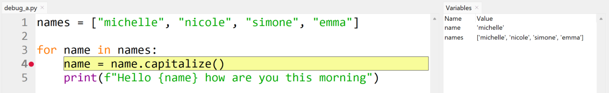

If you now click **Resume** the program will keep running until the next **breakpoint**, which is also line 4 on the second iteration of the `for` loop.


> Notice the changed values in the variables.

Now that we know how to control Thonny's debugger, lets go back and debug `buggy_code.py`.

### Debugging a Logic Error

First let's look closely at `buggy_code.py`:

``` python
def add_underscores(word):
    new_word = "_"
    for index in range(len(word)):
        new_word = word[index] + "_"
    return new_word

phrase = "hello"
print(add_underscores(phrase))
```

#### Step 1: Make a guess about where the bug is located

The first step is to identify the section of code that likely contains the bug. You may not be able to identify exactly where the bug is at first, but you can usually make a reasonable guess about which section of your code has an error.

Notice that the program is split into two distinct sections: a function definition (the block starting at `def add_underscores(word)`, and a main code block that defines a variable phrase with the value `"hello"` and then prints the result of calling `add_underscores(phrase)`.

Look at the main section:

``` python
phrase = "hello"
print(add_underscores(phrase))
```

Do you think the problem could be here? It doesn’t look like it, right? Everything about those two lines of code looks good. So, the problem must be in the function definition:

``` python
def add_underscores(word):
    new_word = "_"
    for index in range(len(word)):
        new_word = word[index] + "_"
    return new_word
```

The first line of code inside the function creates a variable `new_word` with the value `"_"`. You’re all good there, so you can conclude that the problem is somewhere in the body of the `for` loop.

#### Step 2: Set a breakpoint and inspect the code

Now that you’ve identified where the bug must be, set a breakpoint at the start of the `for` loop so that you can trace out exactly what’s happening inside the code with Thonny's debugging tools:

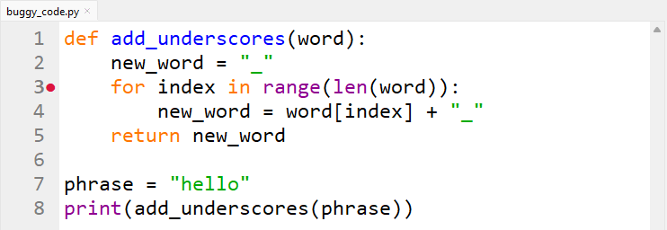

Click the **Debug** button to launch Thonny's debugger. Thonny with ru the code until it hits the breakpoint. Thonny should look like the image below, and there are some new fetaure we haven't seen before.


- **additional debugging window:** you will notice that Thonny has launched a new debugging window for `add_underscores('hello')` function. Whenever a Python enters a new scope Thonny will launch a debugging window for that scope. At the bottom of the `add_underscores('hello')` window you will see the values stored in the **local variables**. **Local variables** are those variables that only the current scope (`add_underscores('hello')` function) can see.
- **multiple stack values:** in the stack panel you will now see two values. The first value `<module>` refers to the main section and the second value refers to the `add_underscores` function section. This shows us that the progam is currently at line 8 in the main program and line 3 of the `add_underscores` function section.

> historically what has happened is at line 8 in the main module the `add_underscores` function was called. The main section is paused at line 8 waiting for the `add_underscores` function to finish. When the `add_underscores` function finishes, the main section will continue the code from line 8 onwards.

Back to our debugging, notice that two local variables, `word` and `new_word`, are displayed. Currently, `word` has the value `'hello'` and `new_word` has the value `'_'` as expected. Let's look futher.

Click **Step into** once and then **Step over** twice to process the `for` loop. You should end up with `new_word = word[index] + "_"` highlighted and ready to process (like below).


Notice the new local variable `index` is storing `0` which is correct for the first iteration of the loop. If you can't see the `index` variable you may need to resize the *Local variables* panel.

Now click **Step over** to execute `new_word = word[index] + "_"` and have a look at the results.

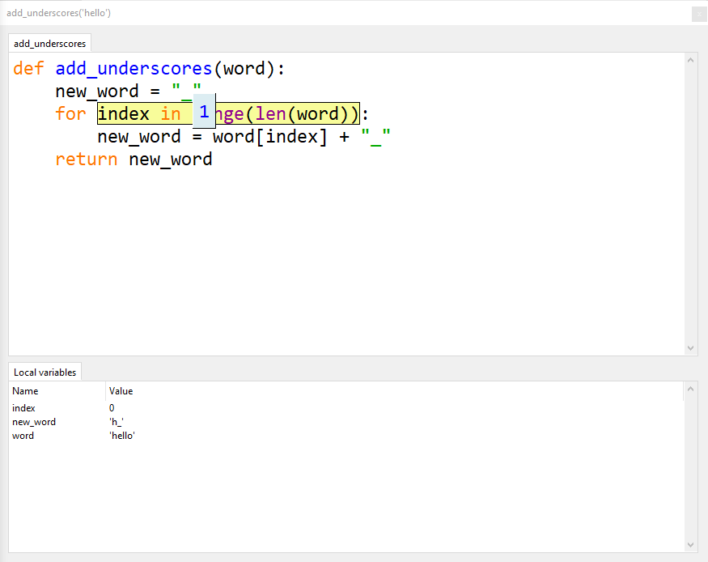

Notice that `new_word` is now storing `'h_'`, whereas we want it to be storing `'_h_'`. What happened there?

So we know the error is in the `new_word = word[index] + "_"` code, so let's step into that code and see exactly what happened.

First click **Stop** and then **Debug** again.

Click **Step into** once and **Step over** twice to once again highlight our problem code


This time we will step into the code and see what happens.

First **Step into** and everything looks good.


Second **Step into** also everything is fine.

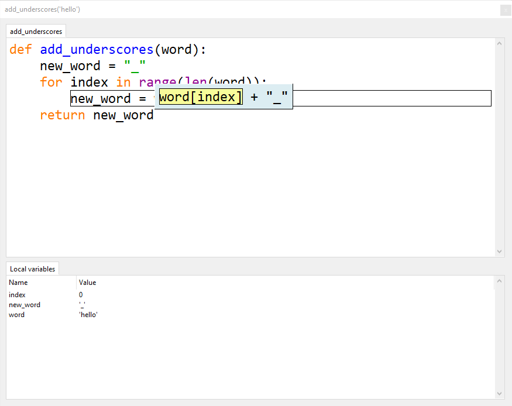

Third **Step into** all good.

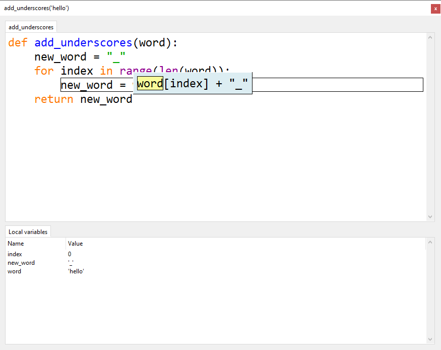

Keep click **Step into** and follow what is happening in the Local variables. Stop when your `add_underscores('hello')` is in the state below:


Looking closely at the debugging code now and you will notice that Python is about to assign the value of `'h_'` to the variable `new_word`. But this is not right! We want it to be storing `'_h_'`. So now that we know exactly where the problem is, we have to work out why it is a problem.

What `add_underscores()` is supposed to do is insert `_` between each letter, by gradually concatenating the next letter and `_` to to all the letters previous processed which is stored in `new_word`. But our code is simply overwriting `new_word` so we are loosing all the previously processed letters. What we need to do is concatenate the current value of `new_word` in front of the processed letter and `_`.

The line should read `new_word = new_word + word[index] + "_"`.

Stop the debugging, make the change and then run the program normally. Is the output `_h_e_l_l_o_`?

Problem solved. You have now completed a debugging task.