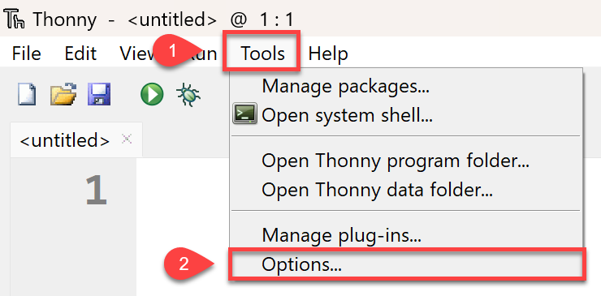
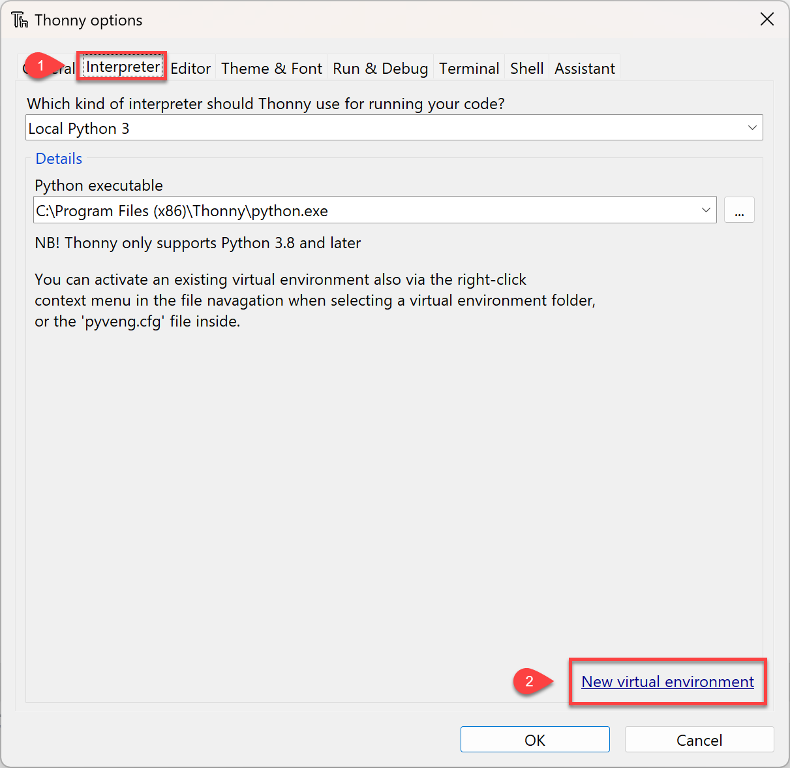
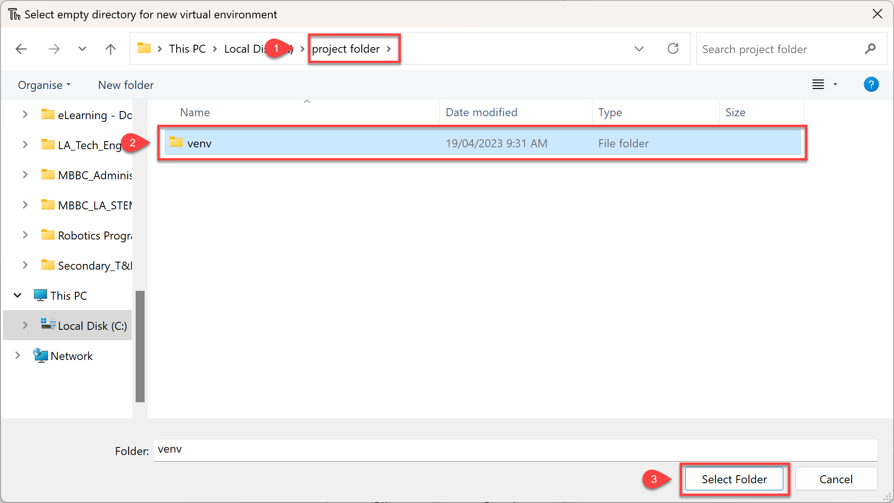
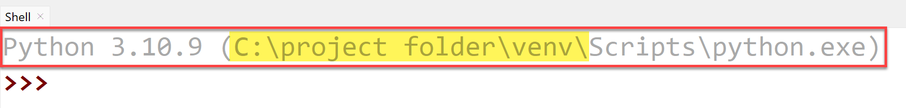
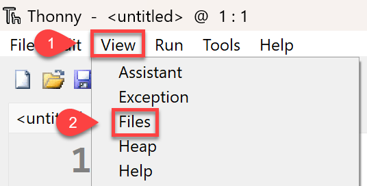
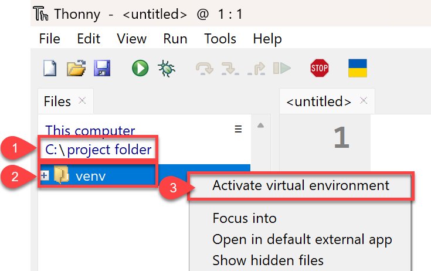
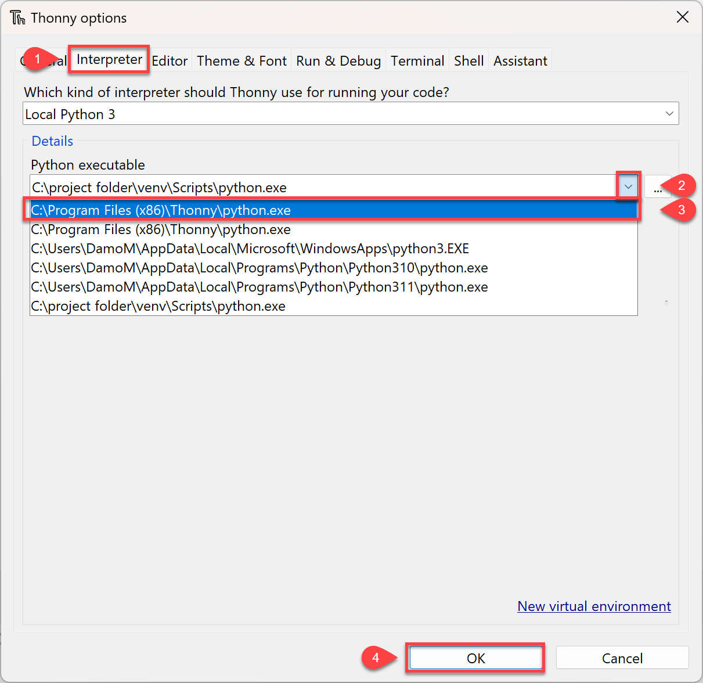

# Integrated Development Environments

We will be looking at two IDEs (Integrated Development Environments):

- Visual Studio Code
- Thonny

## Visual Studio Code

### Create virtual environment

To create a virtual environment in Visual Studio Code, you will need to open the Terminal Pane.

In the terminal type, ensure that you are in your folder directory (it's in the prompt) then type:

**Windows**

```
python -m venv .venv
```

**macOs**

```
python3 -m venv .venv
```

This will create a virtual environment called `.venv`

### Activate virtual environment

Once the virtual environment is created, it may need to be activated. When a virtual environment is activated, it's name will be at the start of the prompt eg. `(.venv)`.

To activated the virtual environment, enter the following at the terminal:

**Windows**

```
.venv/Scripts/Activate.ps1
```

The first time you run this command you may get an execution policy error.

**[Follow these instructions](https://www.stanleyulili.com/powershell/solution-to-running-scripts-is-disabled-on-this-system-error-on-powershell/)** to resolve this problem.

**macOs**

```
source venv/bin/activate
```

### Installing a package

In VSCode we use pip to install packages.

The example pack we will install is PyQt6. 

**Windows**

```

```

## Thonny

### Create virtual environment

To create a virtual environment in Thonny:

1. Click **Tools** &rarr; **Options**



2. Select **Interpreter** &rarr; **New virtual environment**



3. Click **Ok**
4. Navigate to your project folder
5. Create a new folder called `venv`
6. Select the `venv` folder



7. Wait for the process to finish then click **Ok**
8. Your shell should now identify the your new virtual environment as the interpreter.



### Activating virtual environment

If you prompt is not showing you virtual environment interpreter or you have the error below, you will need to activate you virtual environment.

To do this:

1. Click **View** &rarr; **Files**



2. Navigate to your **project folder** &rarr; right mouse click on your **venv** folder &rarr; **Activate virtual environment**



3. Your shell should now identify the your new virtual environment as the interpreter.


### Deactivating virtual environments

To return to the normal Python interpreter:

1. Click **Tools** &rarr; **Options**


2. Choose **Interpreter** &rarr; **Python executable dropdown**
3. Select the **\Thonny\python.exe** option
4. Click **OK**

